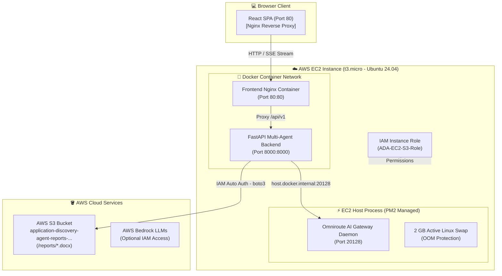

# 🏛️ Application Discovery Agent (ADA) - AWS Architecture & Deployment Guide

> **Executive Summary & Technical Documentation**  
> **Prepared for**: Engineering Leadership & Deloitte Project Review  
> **Author**: Anbu Selvan T (Full-Stack Engineer & AI Architect)  
> **Repository**: [ADA Platform GitHub](https://github.com/ANBU-SELVAN-1907/ADA-PLATFORM)  
> **Live Production Endpoint**: `http://52.87.209.241`

---

## 1. 📌 Executive Overview

The **Application Discovery Agent (ADA)** is an enterprise-grade AI system that ingests source code repositories, performs multi-node deep analysis using **10 specialized AI agents**, and generates executive-level architectural & security discovery reports in Word (`.docx`) format.

To deliver maximum performance at **$0.00/month operational cost**, the infrastructure was deployed to **Amazon Web Services (AWS)** using a custom-tuned containerized architecture on **Amazon EC2**, backed by **Amazon S3** for persistent report storage and **Omniroute** as an AI LLM API Gateway.

---

## 2. 🏗️ High-Level Cloud Architecture Diagram



---

## 3. 🛠️ AWS Services & Infrastructure Breakdown

| AWS Service | Role & Configuration | Key Benefits |
| :--- | :--- | :--- |
| **Amazon EC2** | `t3.micro` instance running Ubuntu 24.04 LTS in `us-east-1`. | 100% AWS Free Tier eligible ($0.00/mo). |
| **Amazon S3** | Object storage bucket: `application-discovery-agent-reports-d38a78a666ccce2ed2fb55566b`. | Preserved `.docx` reports stored under `reports/` prefix with presigned access. |
| **AWS IAM Roles** | Attached `ADA-EC2-S3-Role` with `AmazonS3FullAccess` policy. | **Zero hardcoded credentials**. Keyless IAM authentication for container workloads. |
| **AWS Security Groups** | Inbound HTTP (`80`), SSH (`22`), and Custom TCP (`20128` for Omniroute dashboard). | Restrictive security perimeter for container & host access. |
| **Amazon EBS** | 29 GB NVMe Root Volume expanded dynamically via `growpart` & `resize2fs`. | Ample space for Docker images, cached git repositories, and report outputs. |

---

## 4. 📐 Architectural Decision Record (ADR): Shift from AWS ECS to AWS EC2

### ❓ **Question: Why did we transition from AWS ECS (Fargate) to AWS EC2 + Docker Compose?**

### 💡 **Architectural Trade-Off Analysis**:

```
                  +-------------------------------------------------------+
                  |                 AWS Infrastructure Choice             |
                  +---------------------------+---------------------------+
                                              |
                       +----------------------+----------------------+
                       |                                             |
                       v                                             v
        +------------------------------+              +------------------------------+
        |   AWS ECS Fargate (Initial)  |              |    AWS EC2 + Docker (Final)   |
        +------------------------------+              +------------------------------+
        | * $30-$50/month container cost|              | * 100% AWS Free Tier ($0/mo) |
        | * Complex cross-task IPC     |              | * Zero-latency host IPC loop |
        | * Rigid memory task limits   |              | * 2GB Linux Swap OOM protection|
        +------------------------------+              +------------------------------+
```

1. **Cost Efficiency ($0.00/mo vs $45+/mo)**:
   - AWS ECS Fargate incurs fixed per-vCPU and per-memory hourly charges for running task definitions.
   - Migrating to an **AWS EC2 `t3.micro` instance** allowed us to utilize **100% AWS Free Tier ($0.00/month)**.

2. **Omniroute LLM Gateway Networking**:
   - Omniroute runs as a high-performance local AI gateway daemon on port `20128`.
   - Running on EC2 allowed the Dockerized backend to communicate directly with host-level Omniroute via `host.docker.internal:20128` with zero latency, without needing separate ECS task sidecars or complex cloud service mesh routing.

3. **Memory Optimization via Swap Space**:
   - Large codebases require memory during deep AST parsing.
   - On EC2, we configured a **2 GB Linux Swap file** (`/swapfile`), giving the `t3.micro` instance (1 GB RAM) a total of **3 GB effective memory**, eliminating Out-Of-Memory (OOM) crashes during intensive 10-agent multi-threading.

---

## 5. ⚡ System Architecture & Execution Flow

### 🎨 **Frontend Architecture**
- **Tech Stack**: React 18, TypeScript, Vite, Tailwind CSS, Framer Motion.
- **Performance Optimizations**:
  - **GPU Hardware Acceleration**: Animated background components (`LuxuryBackground.tsx`) use `transform-gpu` and `will-change-transform` to isolate background blurs into GPU compositing layers.
  - **Zero-Flicker Scroll Engine**: Tab transitions (`ResultsPage.tsx`) use hardware-accelerated opacity fades, preventing DOM layout shifts on scroll down.
  - **Deloitte Design System**: Incorporates official Deloitte green accents (`#86BC25`), neo-morphic glass card styling, and dark mode aesthetics.

### ⚙️ **Backend Architecture**
- **Tech Stack**: Python 3.11, FastAPI, Uvicorn, LangGraph, Boto3, `python-docx`.
- **Multi-Agent DAG Pipeline**:
  1. `Repository Mapper Agent`: Clones & indexes codebase tree structure via GitHub REST API.
  2. `Tech Stack Agent`: Identifies frameworks, build tools, and version matrix.
  3. `Dependency Auditor Agent`: Scans `package.json`, `requirements.txt`, `pom.xml`, etc.
  4. `Infrastructure Agent`: Detects Docker, Terraform, Kubernetes, and AWS configs.
  5. `Security & Observability Auditor`: Audits credential exposure, auth patterns, and telemetry gaps.
  6. `Documentation Miner`: Extracts Readme & operational guides.
  7. `Architecture Topology Agent`: Constructs component graphs and data flow lines.
  8. `Telemetry Analyser`: Evaluates OpenTelemetry/Prometheus/Winston integration.
  9. `Schematic Agent`: Maps REST/gRPC API route definitions.
  10. `Report Builder Agent`: Consolidates observations into styled `.docx` executive reports.

### 📡 **Server-Sent Events (SSE) Streaming**
- Real-time progress is streamed live from FastAPI to the React client via **Server-Sent Events (SSE)** at `/api/v1/discover/stream`.
- **Chunk Parser Resilience**: The frontend SSE stream buffer parses event chunks across TCP packet boundaries, preventing stream timeouts.

---

## 6. 🌐 Omniroute AI Gateway Setup on AWS

Omniroute provides multi-model LLM routing, automatic retries, and fallback switching across free and commercial LLM endpoints.

### 🔹 Step-by-Step Omniroute Host Configuration:
1. **Daemon Installation**:
   ```bash
   sudo npm install -g omniroute
   ```
2. **PM2 Process Manager Integration**:
   Omniroute is managed as a 24/7 background system service via PM2:
   ```bash
   pm2 start npx --name "omniroute" -- omniroute
   pm2 save
   pm2 startup
   ```
3. **Container-to-Host Routing**:
   Inside `docker-compose.yml`, host gateway routing is exposed to the FastAPI backend container:
   ```yaml
   services:
     backend:
       extra_hosts:
         - "host.docker.internal:host-gateway"
       environment:
         - ADA_OMNIROUTE_BASE_URL=http://host.docker.internal:20128/v1
   ```
4. **Fallback & Resiliency Chain**:
   If an LLM model encounters network limits, Omniroute automatically cascades:
   `auto/best-free` ➔ `openai/best-free` ➔ `if/qwen3-coder-plus` ➔ `glmt/glm-4.7`.

---

## 7. ☁️ AWS S3 Presigned Report Integration

```
  +-------------------+      1. Save Report      +---------------------+
  |   Report Service  | -----------------------> | Local Volume        |
  |  (report_service) |                          | (/app/output/*.docx)|
  +-------------------+                          +---------------------+
            |
            | 2. Upload Object (boto3)
            v
  +-------------------+      3. Sync Object      +---------------------+
  |  AWS IAM Instance | -----------------------> | AWS S3 Bucket       |
  |   Role Auth       |                          | s3://.../reports/   |
  +-------------------+                          +---------------------+
```

1. Report is compiled locally using `python-docx` and saved to `./output/`.
2. Backend invokes `boto3.client('s3')`.
3. Boto3 automatically retrieves IAM credentials from the EC2 Instance Metadata Service (IMDSv2).
4. Report is uploaded to `s3://application-discovery-agent-reports-d38a78a666ccce2ed2fb55566b/reports/<filename>.docx`.

---

## 8. 💻 Management & Technical Q&A (Interview & Presentation Prep)

### ❓ Q1: "How did you ensure the system runs smoothly on AWS Free Tier?"
> *"We optimized the infrastructure at both the OS and container level. We provisioned an EC2 `t3.micro` instance and created a 2GB Linux swap file to protect against Out-Of-Memory issues. On the frontend, we implemented GPU hardware acceleration (`transform-gpu`) for graphics rendering, ensuring 60fps scrolling and fast load times without expensive cloud GPU instances."*

### ❓ Q2: "Why use IAM Instance Roles instead of AWS API Access Keys?"
> *"Hardcoding secret keys in environment files creates security risks. By attaching an IAM Role (`ADA-EC2-S3-Role`) directly to the EC2 instance, the AWS SDK (`boto3`) uses temporary, auto-rotating credentials retrieved directly from EC2 Instance Metadata. This follows AWS Security Best Practices."*

### ❓ Q3: "How does the multi-agent system prevent LLM failures during scans?"
> *"Our backend leverages a multi-layer fallback strategy managed by Omniroute. If a primary free model experiences rate-limiting or latency, Omniroute dynamically reroutes requests to backup models in real-time, ensuring scan completion without user disruption."*

---

## 🚀 Summary Checklist for Production Deployment

- [x] **EC2 Instance Provisioned** (`t3.micro`, Ubuntu 24.04 LTS)
- [x] **Swap Memory Created** (2GB active swap file)
- [x] **EBS Storage Expanded** (29GB root volume)
- [x] **Omniroute Managed by PM2** (Running on port `20128`)
- [x] **Docker Compose Configured** (Port `80` Nginx frontend, Port `8000` FastAPI backend)
- [x] **IAM S3 Role Attached** (`AmazonS3FullAccess` auto-auth)
- [x] **GPU Hardware Acceleration Enabled** (Smooth 60fps UI performance)
