# 🧠 ADA — Deep Schematic Discovery Engine: Complete Flow Maps

## 📊 Master Architecture Overview

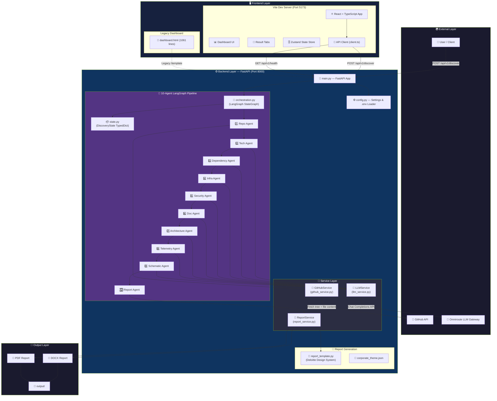

---

## 🔄 Complete Request Lifecycle Flow

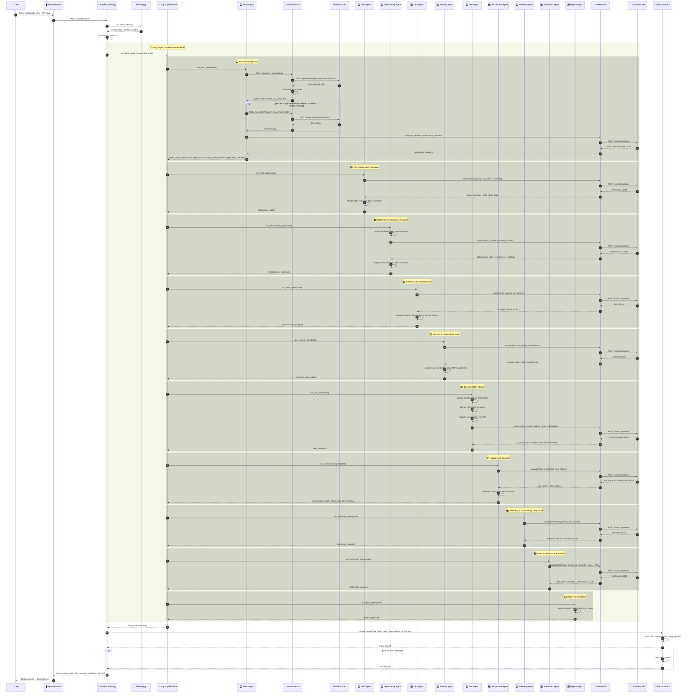

---

## 🤖 Agent Detail Flow — Each Agent's Internal Process

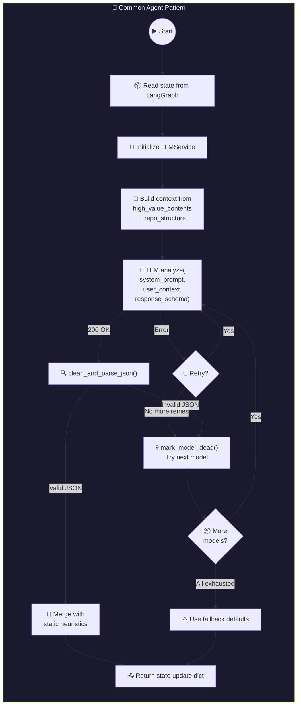

---

## 🔗 State Flow — What Each Agent Reads & Writes

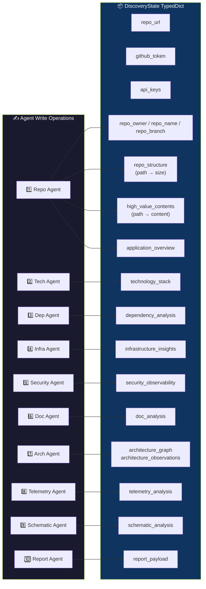

---

## 🧠 LLM Service — Model Fallback & Retry Flow

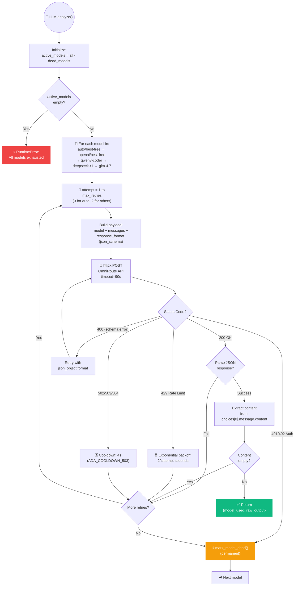

---

## 🐙 GitHub Service — File Ingestion Flow

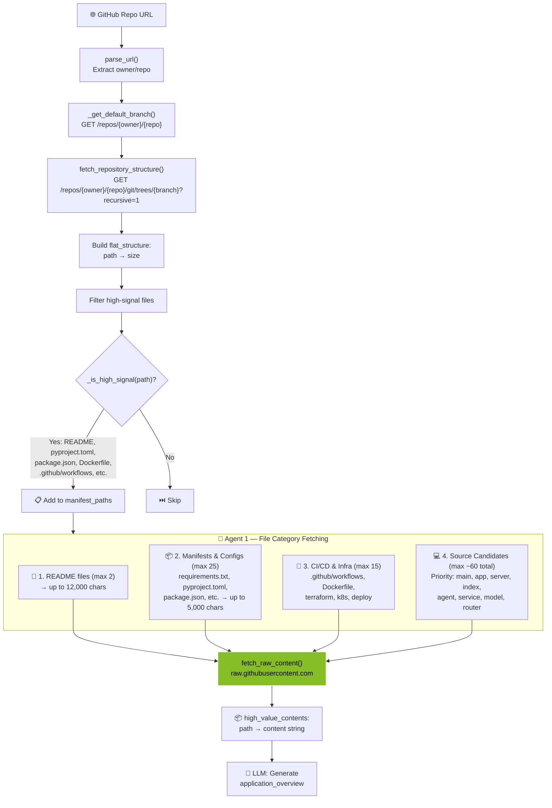

---

## 📄 Report Generation Flow

```mermaid
flowchart TD
    INPUT["📦 final_state<br/>(all agent outputs)"] --> UNPACK["Unpack payloads:<br/>tech_data, dep_data, infra_data,<br/>sec_data, telemetry, schematic,<br/>arch_graph, arch_obs, app_overview"]

    UNPACK --> P1["📄 PAGE 1: Cover Page<br/>• Brand: DELOITTE AI ASSISTANCE<br/>• Title: APPLICATION DISCOVERY<br/>• Metadata: repo, date, version<br/>• Distribution Notice"]
    P1 --> P2["📄 PAGE 2: Executive Summary<br/>• AI executive summary<br/>• WHAT/STACK/SCALE/RISK/ACTION table"]
    P2 --> P3["📄 PAGE 3: Application Summary<br/>• Telemetry & Attributes table<br/>• Key Logical Components table"]
    P3 --> P4["📄 PAGE 4: Technology Stack<br/>• AI stack_summary<br/>• 4-col tech table (layer/tech/version/usage)"]
    P4 --> P5["📄 PAGE 5: Dependencies<br/>• Database summary<br/>• Package table<br/>• Persistence roadmap table"]
    P5 --> P6["📄 PAGE 6: Infrastructure<br/>• Scaling configurations table<br/>• Docker, CI/CD, cloud services"]
    P6 --> P7["📄 PAGE 7: Security & Observability<br/>• Risk table (severity-colored)<br/>• Observability posture"]
    P7 --> P8["📄 PAGE 8: Architecture<br/>• Advisory Pattern Analysis bullets<br/>• ASCII Topography Graph"]
    P8 --> P9["📄 PAGE 9: Assumptions & Limitations<br/>• Analytical assumptions<br/>• System limitations"]
    P9 --> P10["📄 PAGE 10: Telemetry Analysis<br/>• Observability score callout<br/>• 6-dimension detail table<br/>• Recommendations"]
    P10 --> P11["📄 PAGE 11: Deep Schematic Analysis<br/>• Data flow lifecycle<br/>• Module dependency table<br/>• API surface catalog<br/>• Auth/Config/Error schematics"]

    P11 --> SAVE["💾 Save DOCX<br/>output/Deloitte_AI_Insights_{name}_{ts}.docx"]
    SAVE --> FMT{"format == 'pdf'?"}
    FMT -->|"Yes"| PDF["📕 docx2pdf convert<br/>→ PDF output"]
    FMT -->|"No"| DOCX["✅ Return DOCX path"]

    style P1 fill:#86BC24,stroke:#fff,color:#000
    style SAVE fill:#00A3E0,stroke:#fff,color:#fff
```

---

## 🖥️ Frontend — React App Architecture

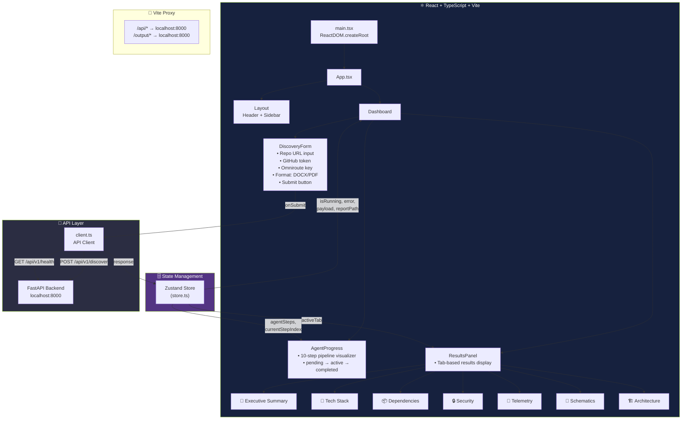

---

## 🔌 Service Layer — Dependency Map

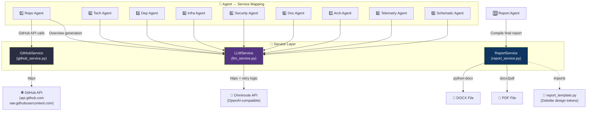

---

## ⚡ Error Handling & Resilience Flow

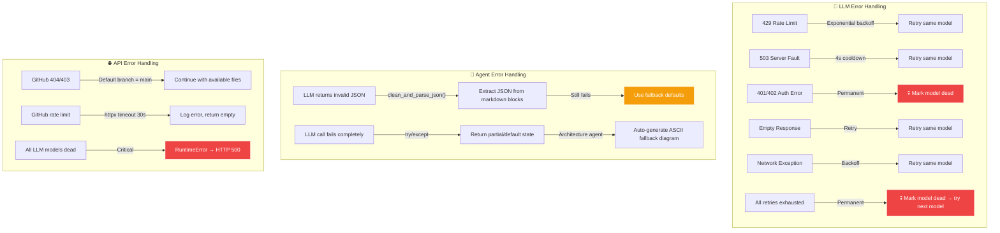

---

## 🏗️ File Structure Map

```mermaid
graph TD
    ROOT["📁 gem/"] --> MAIN_PY["🚀 main.py<br/>FastAPI app entry point"]
    ROOT --> CONFIG["⚙️ config.py<br/>.env loader + Settings"]
    ROOT --> REPORT_TPL["🎨 report_template.py<br/>Deloitte design system"]
    ROOT --> REQ["📋 requirements.txt"]
    ROOT --> ENV["🔐 .env<br/>API keys + config"]
    ROOT --> PLAN["📝 plan.md<br/>Frontend roadmap"]

    ROOT --> AGENTS_DIR["🤖 agents/"]
    AGENTS_DIR --> STATE["📦 state.py<br/>DiscoveryState TypedDict"]
    AGENTS_DIR --> ORCH["🎵 orchestration.py<br/>LangGraph 10-node pipeline<br/>+ Architecture, Telemetry,<br/>Schematic agents"]
    AGENTS_DIR --> A1["1️⃣ repo_agent.py"]
    AGENTS_DIR --> A2["2️⃣ tech_agent.py"]
    AGENTS_DIR --> A3["3️⃣ dependency_agent.py"]
    AGENTS_DIR --> A4["4️⃣ infra_agent.py"]
    AGENTS_DIR --> A5["5️⃣ security_agent.py"]
    AGENTS_DIR --> A6["6️⃣ doc_agent.py"]
    AGENTS_DIR --> A10["🔟 report_agent.py"]

    ROOT --> SERVICES_DIR["🔧 services/"]
    SERVICES_DIR --> GH_SVC["🐙 github_service.py<br/>GitHub API wrapper"]
    SERVICES_DIR --> LLM_SVC["🧠 llm_service.py<br/>Omniroute LLM client<br/>+ model fallback chain"]
    SERVICES_DIR --> RPT_SVC["📄 report_service.py<br/>DOCX/PDF generation"]

    ROOT --> TEMPLATES_DIR["📁 templates/"]
    TEMPLATES_DIR --> DASH_HTML["🖥️ dashboard.html<br/>Legacy vanilla dashboard"]
    TEMPLATES_DIR --> THEME_JSON["🎨 corporate_theme.json"]

    ROOT --> FRONTEND_DIR["⚛️ frontend/"]
    FRONTEND_DIR --> F_MAIN["main.tsx"]
    FRONTEND_DIR --> F_STORE["store.ts<br/>Zustand state"]
    FRONTEND_DIR --> F_TYPES["types/index.ts<br/>TypeScript interfaces"]
    FRONTEND_DIR --> F_CLIENT["api/client.ts<br/>API client"]
    FRONTEND_DIR --> F_CSS["index.css<br/>Tailwind + custom components"]
    FRONTEND_DIR --> F_VITE["vite.config.ts<br/>Proxy + build config"]

    ROOT --> OUTPUT_DIR["📂 output/"]
    OUTPUT_DIR --> DOCX_FILES["📄 *.docx reports"]
    OUTPUT_DIR --> PDF_FILES["📕 *.pdf reports"]

    ROOT --> SRC_DIR["📁 src/"]
    SRC_DIR --> DASH_TSX["components/Dashboard.tsx<br/>(empty — planned)"]

    style ROOT fill:#0A0E17,stroke:#86BC24,color:#fff
    style AGENTS_DIR fill:#533483,stroke:#86BC24,color:#fff
    style SERVICES_DIR fill:#2b2d42,stroke:#86BC24,color:#fff
    style FRONTEND_DIR fill:#16213e,stroke:#86BC24,color:#fff
```

---

## 🎯 Quick Summary — The Perfect One-Flow

```mermaid
graph LR
    USER["👤 User submits<br/>GitHub URL"] -->|"POST /api/v1/discover"| FASTAPI["🚀 FastAPI"]

    FASTAPI -->|"1"| REPO["1️⃣ Repo Agent<br/>Fetches tree + files<br/>from GitHub API"]
    REPO -->|"2"| TECH["2️⃣ Tech Agent<br/>Identifies languages,<br/>frameworks, tools"]
    TECH -->|"3"| DEPS["3️⃣ Dep Agent<br/>Parses manifests<br/>Maps dependencies"]
    DEPS -->|"4"| INFRA["4️⃣ Infra Agent<br/>Docker, CI/CD,<br/>cloud services"]
    INFRA -->|"5"| SEC["5️⃣ Security Agent<br/>Vulnerabilities,<br/>auth mechanisms"]
    SEC -->|"6"| DOC["6️⃣ Doc Agent<br/>README, API docs,<br/>docstrings"]
    DOC -->|"7"| ARCH["7️⃣ Architecture Agent<br/>ASCII diagram,<br/>observations"]
    ARCH -->|"8"| TELE["8️⃣ Telemetry Agent<br/>Logging, metrics,<br/>tracing score"]
    TELE -->|"9"| SCHEM["9️⃣ Schematic Agent<br/>Data flows, modules,<br/>API surface"]
    SCHEM -->|"10"| REPORT["🔟 Report Agent<br/>Consolidates all"]

    REPORT -->|"Compile"| DOCX["📄 DOCX Report<br/>(Deloitte branded)"]
    DOCX -.->|"Optional"| PDF["📕 PDF Report"]
    DOCX -->|"Return path"| USER

    style USER fill:#86BC24,stroke:#fff,color:#000
    style FASTAPI fill:#00A3E0,stroke:#fff,color:#fff
    style DOCX fill:#86BC24,stroke:#fff,color:#000
```

---

## 🔑 Key Data Flow Summary

| Step | Agent | Reads From State | Writes To State | External Call |
|------|-------|------------------|-----------------|---------------|
| 1 | **Repo Agent** | `repo_url`, `github_token` | `repo_owner`, `repo_name`, `repo_branch`, `repo_structure`, `high_value_contents`, `application_overview` | GitHub API + LLM |
| 2 | **Tech Agent** | `high_value_contents`, `repo_structure` | `technology_stack` | LLM |
| 3 | **Dep Agent** | `high_value_contents`, `repo_structure` | `dependency_analysis` | LLM |
| 4 | **Infra Agent** | `high_value_contents`, `repo_structure` | `infrastructure_insights` | LLM |
| 5 | **Security Agent** | `high_value_contents`, `repo_structure` | `security_observability` | LLM |
| 6 | **Doc Agent** | `high_value_contents`, `repo_structure` | `doc_analysis` | LLM |
| 7 | **Arch Agent** | `high_value_contents`, `repo_structure` | `architecture_graph`, `architecture_observations` | LLM |
| 8 | **Telemetry Agent** | `high_value_contents`, `security_observability` | `telemetry_analysis` | LLM |
| 9 | **Schematic Agent** | `high_value_contents`, `dependency_analysis`, `doc_analysis` | `schematic_analysis` | LLM |
| 10 | **Report Agent** | All previous outputs | `report_payload` | None |
